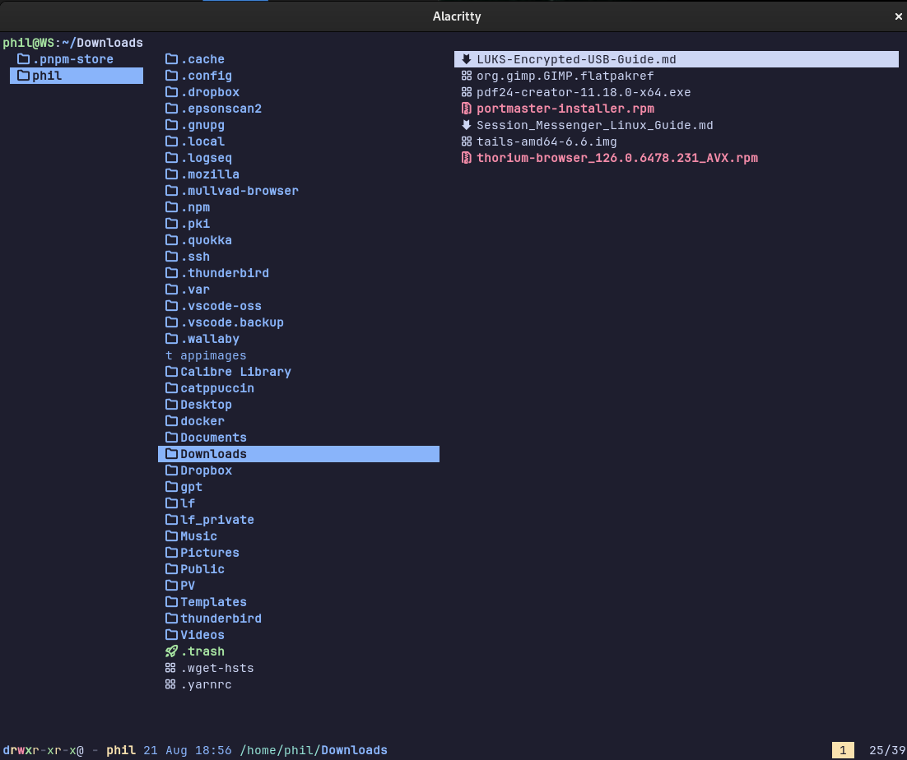

<h3 align="center">
	 
	
	Catppuccin for <a href="https://github.com/catppuccin/template">App</a>
	
</h3>

	
	
	

	

## Previews

🌿 Mocha

Please be aware that I also use the [Alacritty Terminal Mocha Theme](https://github.com/catppuccin/alacritty).  
If you don't then your lf file manager might look different.

## Usage

0. I assume I do not have to explain anything about lf-installation or lf-configuration.  
   If you are here, you know what you are doing.

1. Execute the commands for the creation of the directory structure as intende by the [lf OG](https://github.com/gokcehan/lf/wiki/Colors-and-Icons):

   `mkdir -p ~/.config/lf`  
   `curl https://raw.githubusercontent.com/gokcehan/lf/master/etc/colors.example -o ~/.config/lf/colors`  
   `curl https://raw.githubusercontent.com/gokcehan/lf/master/etc/icons.example -o ~/.config/lf/icons`

2. Clone this repo and cd into it.  
   `git clone https://github.com/catppuccin/lf && cd lf`

3. Replace the `colors`-file with the wanted flavor file from this repo by executing either one of the following commands:  
   (Please use mocha everywhere - your eyes will thank you in 15 years if you use dark mode.)  
   `mv -f ./config/colors.latte ~/.config/lf/colors`  
   `mv -f ./config/colors.frappe ~/.config/lf/colors`  
   `mv -f ./config/colors.macciato ~/.config/lf/colors`  
   `mv -f ./config/colors.mocha ~/.config/lf/colors`

4. Backup your own config and adopt my lf-config if you like:  
   `mv ~/.config/lf/lfrc ~/.config/lf/lfrc.bak && mv -f ./config/lfrc ~/.config/lf/lfrc`

<!-- The FAQ section is optional. Remove if needed.-->

## 🙋 FAQ

- Q: **_"How can I do X?"_**\
  A: ...

## 💝 Thanks to

- [Human](https://github.com/catppuccin)

&nbsp;

	

	Copyright &copy; 2021-present <a href="https://github.com/catppuccin" target="_blank">Catppuccin Org</a>

	

